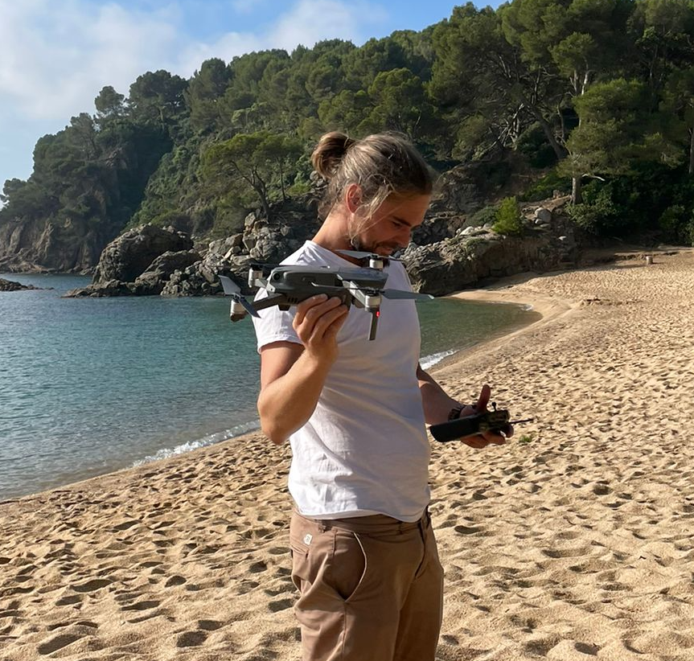

Hi, I'm **Fer**. 

I studied Marine Sciences but part of what I understand about the ocean was learned through years of **work at sea**, fishing, sailing or diving for marine resources, crisscrossing ports, countries, waves and mountains along the way. Over time, I returned to science, working at the intersection of **remote sensing**, **geospatial** analysis and marine **ecology**, with a particular interest in seagrass meadows and macroalgal forests: an attempt to read patterns in coastal systems without losing sight of the textures that shape them. 

I currently work at the **Seagrass Ecology Group** (GEAM) of the the Spanish Institute of Oceanography (IEO-CSIC), mapping and monitoring seagrass meadows in response to European environmental frameworks. I am also pursuing a PhD exploring the balance between field observations and remotely sensed products at different scales.

<a href="cv.html" class="cv-badge">View CV</a>

  

