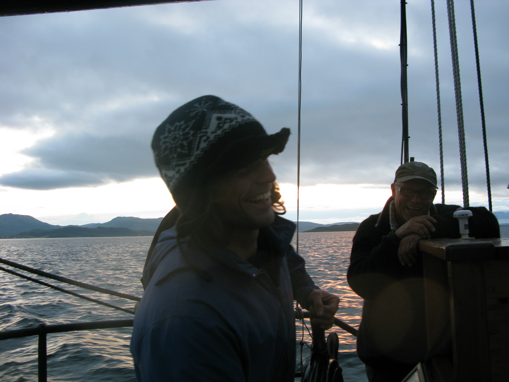

I’m a geospatial analyst drawn to the quiet complexity of coastal environments. My current work focuses on seagrass meadows and macroalgal forests, landscapes often overlooked, yet fundamental to life along the shore.

I trained in Marine Sciences but part of what I understand about the ocean was learned outside formal training. After a brief period in international development in [Haiti](https://kodeanvet.wordpress.com), I turned back to the sea, not as a researcher at first, but as a worker within it. I fished on French trawlers and in Caribbean artisanal fisheries, sailed the Atlantic and the Arctic Circle, met the Malvinas current, and dived for marine resources in Asturias and Australia, among other trades, crisscrossing ports, waves and mountains along the way. Those years of wild wonder were another way of getting to know the ocean: its rhythms, its uncertainties, forms of knowledge that rarely make their way into datasets. Over time, I returned to science, becoming a remote sensing and geospatial analyst: an attempt to read patterns in coastal systems without losing sight of the textures that shape them.

I currently work at the Seagrass Ecology Group of the Spanish Institute of Oceanography (IEO-CSIC) and I am based at the Oceanographic Center of Gijón. We study the distribution, pressures and ecological status of marine angiosperms across  intertidal and subtidal environments. My work focuses on developing methods to assess the extent and trends of these coastal ecosystems, combining remote sensing with ecological knowledge. Through my PhD, I explore the balance between field observations and remotely sensed products, with a particular interest geospatial data visualization.

{fig-align="center" width="70%"}

