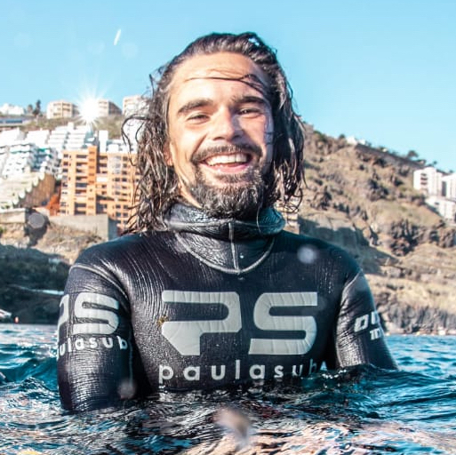

::: {.cv-container}

::: {.cv-sidebar}

::: {.cv-sidebar-top}

{.profile-photo}

### Fernando   García-González
Geospatial analyst  
Seagrass Ecology Group  
(IEO-CSIC)

:::

::: {.cv-sidebar-body}

-  [0000-0003-4042-6789](https://orcid.org/0000-0003-4042-6789)
- <i class="bi bi-envelope"></i> [f.garcia@ieo.csic.es](mailto:f.garcia@ieo.csic.es)
- <i class="bi bi-telephone"></i> [+34 688 92 92 40](tel:+34688929240)
- 🌐 [Research portfolio](https://fer-at-sea.github.io)
- <i class="bi bi-github"></i> [GitHub](https://github.com/fer-at-sea)

## LANGUAGES

- Spanish 
- English 
- French 
- Haitian Creole

## INTERESTS

- Marine ecology
- Field data collection
- Remote sensing
- Drones
- Geospatial analysis
- Data visualization
- Surfing
- Freediving
- Sailing
- Hiking

:::

:::

::: {.cv-main}

My work lies at the interface between optical remote sensing and applied marine ecology, with an special focus on seagrass meadows and macroalgal forests.

## Education

**Ongoing PhD** - University of Girona, Spain  

- Remote sensing of marine vegetation for monitoring and managing coastal ecosystems. [Research plan](https://fer-at-sea.github.io/phd_research_plan/)

**MSc in Remote Sensing** - University of Extremadura, Spain (2021)  

- Master thesis: García-González, F., Quiros-Rosado, E., Cebrian, E., & Boada, J. (2021). *Efficiency of Sentinel-2 to monitor marine protected areas: bathymetry and cartography of underwater coastal habitats by means of remote sensing* http://hdl.handle.net/10662/17008
- Erasmus+ internship at LOV-IMEV-Sorbonne University, France.
- Field expedition at Lerins Islands coordinated by ECOSEAS-Nice University, France.

**MSc in Coastal Management** - University of Western Brittany, France (2013)  

- Professional internship as an NGO worker in Haiti, followed by a contract to manage a small-scale food security [project](https://kodeanvet.wordpress.com).

**BSc in Marine Sciences and Oceanography** - University of Vigo (2012)  

- SICUE-SENECA mobility grant at University of Las Palmas de Gran Canaria.
- JAE-INTRO research grant internship at INCAR-CSIC.
- Academic mobility at University of Colima, Mexico.
- Erasmus grant at IUEM, University of Western Brittany, France.

## Contributions



## Work Experience

- **Drone pilot and remote sensing analyst** - Advanced Center of Studies of Blanes (CEAB-CSIC). Organization and participation in underwater campaigns, drone surveys, data preparation, report writing and outreach across several contracts from 2021 to 2023.
- **Professional diver** - Eight summer campaigns as a seaweed collector diver in Asturias (2015-2022). One campaign as a holothurian collector diver in the Great Barrier Reef, Australia (2019). >2000 logged hours.
- **Sailing** - Two transatlantic crossings (2014 and 2017). Charted vessels: Guadeloupe-Haiti (2013), Germany (2012), France-Norway (2012). >7000 nautical miles.
- **Fishing** - Work on several vessels across different countries. Artisanal fishing  in Australia (2019), Guadeloupe (2013) and Asturias (2015-2016). Trawling in France (2012-2013).
- **NGO coordinator** - Country manager for the Spanish NGO Aida in Haiti (2013).
- **Kids** - Assistant teacher in elementary schools in France (2012).
- **Lifeguard** - Work in beaches and swimming pools for the Red Cross during summers from 2007 to 2015.

## Merits

- Erasmus+ grant to stay at LOV-IMEV, Sorbonne University, France (2022).
- Literature award: *Lava*, short story awarded with a 1,000 EUR prize, Spain (2016).
- Erasmus grant to study at IUEM-UBO, France (2012).
- University of Vigo grant to study at the University of Colima, Mexico (2011).
- SICUE-SENECA grant to study at the University of Las Palmas de Gran Canaria, Spain (2010).
- JAE-INTRO to research grant for a research stay at INCAR-CSIC, Spain (2010).
- Cum laude high school distinction, ranked first in the promotion, Spain (2007).
- USA National Honor Society member at J.L. Mann High School, USA (2006).

## Courses and Certificates

- Marine Biodiversity Data Mobilization Workshop, OBIS (2023).
- Python: Applied machine learning, CEINPRO, 150h (2022) + Advanced python, CSIC, 40h (2023)
- Google Earth Engine and biodiversity analysis using QGIS/GEE, Geoinnova, 125h (2022).
- Hyperspectral remote sensing workshop, German Space Agency (2022).
- A1/A2/A3 Drone pilot.
- Free diver instructor, AIDA (2021), personal best: -43m CWT.
- SCUBA diver instructor, PADI (2020).
- Emergency and first response instructor, EFR (2020).
- Scientific diver (2010), professional diver (2015) and professional skipper (2016).

:::

:::
